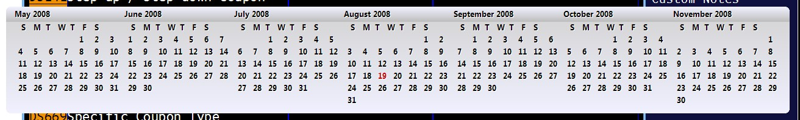



## Desktop Alpha Calendar Widget

### Description

Desktop calendar in multi month grid format.

cursor left/right increments and decrements by month

cursor up/down increments and decrements by year

mouse click in the very left/right to go forward/backward by month

drag the form by it's banner

'a' will toggle the alpha attribute of the form

click the very bottom of the form to unload

dbl-click to toggle stay-on-top
 
### More Info
 

             |
---                |---
**Submitted On**   |2008-08-19 11:20:02
**By**             |[Michael Toye](https://github.com/Planet-Source-Code/PSCIndex/blob/master/ByAuthor/michael-toye.md)
**Level**          |Beginner
**User Rating**    |5.0 (15 globes from 3 users)
**Compatibility**  |VB 6\.0
**Category**       |[Complete Applications](https://github.com/Planet-Source-Code/PSCIndex/blob/master/ByCategory/complete-applications__1-27.md)
**World**          |[Visual Basic](https://github.com/Planet-Source-Code/PSCIndex/blob/master/ByWorld/visual-basic.md)
**Archive File**   |[Desktop\_Al2124018192008\.zip](https://github.com/Planet-Source-Code/michael-toye-desktop-alpha-calendar-widget__1-70980/archive/master.zip)

